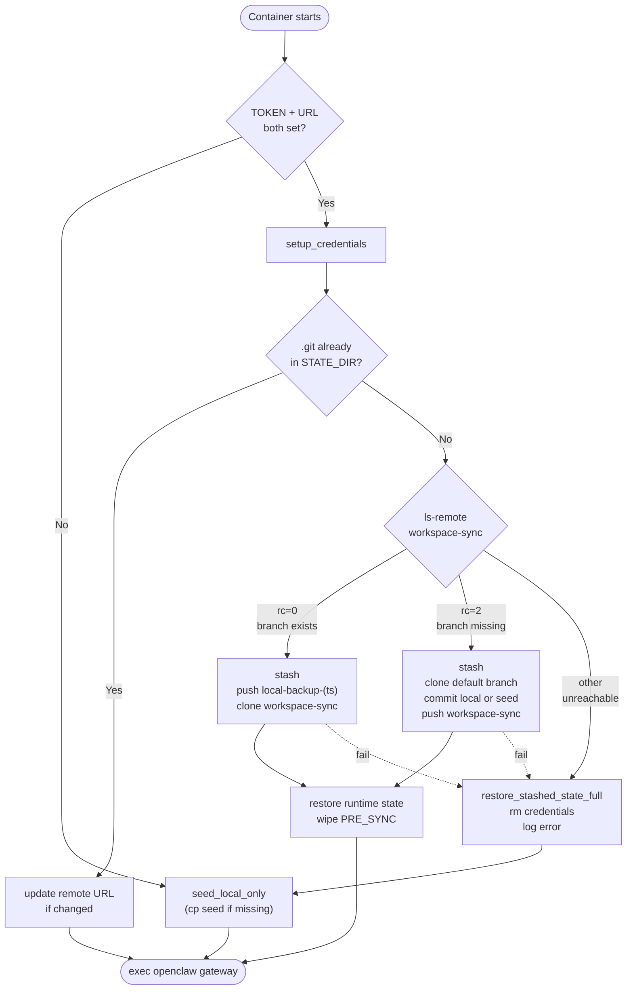

# Boot Scenarios

Every scenario `init.sh` handles at container boot, with the resulting end state. Read this when reasoning about `~/.openclaw/` lifecycle, debugging boot failures, or verifying a transition.

## Inputs

Three signals determine the boot path:

1. **Container state** — what's in `~/.openclaw/` (the persistent volume) at boot:
   - `empty` — fresh volume
   - `local-only` — has `workspace/`, `openclaw.json`, runtime state (`credentials/`, `agents/`, `cron/`), but no `.git`
   - `sync` — has `.git` (clone of `workspace-sync` from a prior boot)
2. **Env vars** — `WORKSPACE_GIT_TOKEN` + `WORKSPACE_GIT_URL` either both set, or sync disabled
3. **Remote state** — `workspace-sync` branch on the remote: exists / doesn't exist / unreachable. Only checked when env vars are set AND no local `.git` yet.

## Decision tree

## Scenarios

### 1. First deploy, sync NOT configured

| Input | Value |
|---|---|
| Container state | empty |
| Env vars | absent |
| Remote state | n/a |

Path: `seed_local_only` → exec gateway.

End state: `~/.openclaw/{workspace, openclaw.json}` from seed. No `.git`. Local-only mode. Gateway runs without sync.

---

### 2. First deploy, sync configured, branch MISSING on remote

| Input | Value |
|---|---|
| Container state | empty |
| Env vars | set |
| Remote state | no `workspace-sync` |

Path: `setup_credentials` → `setup_sync` → ls-remote rc=2 → `stash_existing_state` (no-op, dir empty) → `create_workspace_sync` (clone default branch, copy seed since stash is empty, commit, push) → `restore_stashed_runtime_state` (no-op).

End state: `~/.openclaw/` is a clone of the freshly-created `workspace-sync` (seed-based content + inherited main files). Sync mode.

---

### 3. First deploy, sync configured, branch EXISTS on remote

| Input | Value |
|---|---|
| Container state | empty |
| Env vars | set |
| Remote state | `workspace-sync` exists (e.g., teammate already deployed) |

Path: `setup_credentials` → `setup_sync` → ls-remote rc=0 → `stash_existing_state` (no-op) → `push_local_to_backup_branch` (no-op, no local files to back up — function returns 0 early) → `clone_workspace_sync` → `restore_stashed_runtime_state` (no-op).

End state: `~/.openclaw/` is a clone of the existing `workspace-sync`. New container inherits whatever the team's been syncing. Sync mode. **No backup branch created** — there was nothing local to back up.

---

### 4. Existing local-only state, sync NOT configured (continued local-only)

| Input | Value |
|---|---|
| Container state | local-only |
| Env vars | absent |
| Remote state | n/a |

Path: `seed_local_only` (no-op, files exist) → exec gateway.

End state: unchanged from prior boot. Local-only continues.

---

### 5. Local-only → sync, branch MISSING on remote

| Input | Value |
|---|---|
| Container state | local-only |
| Env vars | newly set |
| Remote state | no `workspace-sync` |

Path: `setup_credentials` → `setup_sync` → ls-remote rc=2 → `stash_existing_state` (move `workspace/`, `openclaw.json`, `credentials/`, `agents/`, `cron/` to `~/.openclaw-pre-sync/`) → `create_workspace_sync` (clone default branch into now-empty STATE_DIR, `mv` the user's `workspace/` and `openclaw.json` from PRE_SYNC, commit as initial workspace-sync content, push) → `restore_stashed_runtime_state` (move runtime state from PRE_SYNC back to STATE_DIR, wipe PRE_SYNC).

End state: `~/.openclaw/` has `.git` for `workspace-sync`. **The initial commit IS the user's local state.** Runtime state preserved. PRE_SYNC gone.

---

### 6. Local-only → sync, branch EXISTS on remote

| Input | Value |
|---|---|
| Container state | local-only |
| Env vars | newly set |
| Remote state | `workspace-sync` exists |

Path: `setup_credentials` → `setup_sync` → ls-remote rc=0 → `stash_existing_state` (move all to PRE_SYNC) → `push_local_to_backup_branch` (copy `workspace/` + `openclaw.json` to a `/tmp/` working dir, init repo on `local-backup-(ts)` branch, commit, push) → `clone_workspace_sync` (clone existing canonical branch) → `restore_stashed_runtime_state` (runtime state restored, `workspace/` + `openclaw.json` skipped since clone is canonical, PRE_SYNC wiped).

End state: `~/.openclaw/` has the canonical remote `workspace-sync`. The user's prior local `workspace/` + `openclaw.json` are preserved on a `local-backup-(ts)` branch on GitHub — inspect and merge from there via the GitHub UI. Runtime state preserved locally.

---

### 7. Restart with sync already configured, no env changes

| Input | Value |
|---|---|
| Container state | sync (.git present) |
| Env vars | unchanged |
| Remote state | n/a |

Path: `setup_credentials` → `setup_sync` → `.git` present, URL matches → return 0 immediately. No probe, no clone.

End state: unchanged. Fast path (~5 syscalls).

---

### 8. Restart with sync configured, URL changed

| Input | Value |
|---|---|
| Container state | sync (.git present) |
| Env vars | URL differs from `git remote get-url origin` |
| Remote state | n/a |

Path: `setup_credentials` → `setup_sync` → `.git` present, URL mismatch → `git remote set-url origin <new>` → return 0. No re-clone (would lose state).

End state: same content, new origin. Next agent sync goes to the new repo. If you want a fresh clone from the new URL, wipe the volume (`docker compose down -v`).

---

### 9. Sync was configured, env vars subsequently removed

| Input | Value |
|---|---|
| Container state | sync (.git present) |
| Env vars | absent |
| Remote state | n/a |

Path: skip `setup_credentials` and `setup_sync`. `seed_local_only` (no-op, files exist) → exec gateway.

End state: **quirky** — `.git` lingers; `sync-status-inject` hook detects it and tells the agent sync is on; but `~/.git-credentials` is gone (nothing wrote it this boot) so any sync operation fails on auth. Recovery: re-set the env vars, OR `docker compose down -v` to start clean.

---

### Failure paths

Any failure during sync setup triggers `restore_stashed_state_full`, then falls through to local-only:

- **URL probe failure** (bad token, bad URL, network down): `setup_sync` returns 1 immediately. No stash, nothing to restore. Fall through to `seed_local_only`. PAT might be reachable next time.
- **Backup-push failure** (scenario 6 path): `push_local_to_backup_branch` returns non-zero → `restore_stashed_state_full` (nuke partial `.git`, `mv` PRE_SYNC contents back to STATE_DIR, wipe PRE_SYNC) → fall through. **Local state preserved**, user retries.
- **Clone failure** (scenario 6 path): `clone_workspace_sync` fails → same restore path.
- **Create failure** (scenario 5 path, e.g., commit/push rejection): `create_workspace_sync` aborts via `set -e` → same restore path.

In all cases the container ends up in local-only mode with the user's prior state intact. Logs show `init.sh: sync setup failed (check WORKSPACE_GIT_URL and WORKSPACE_GIT_TOKEN); falling back to local-only`.

---

## What the agent sees at runtime

After boot, the `sync-status-inject` hook runs on every `agent:bootstrap` event and prepends a runtime-state marker to `AGENTS.md` based solely on `~/.openclaw/.git` existence. So the agent sees:

- "sync ON" — scenarios 2, 3, 5, 6, 7, 8 (and scenario 9, misleadingly)
- "sync OFF" — scenarios 1, 4, and any failure-fallback boot

Agent-driven sync (the `git-sync` skill, `add → commit → pull --rebase → push`, with `backup/(ts)` on rebase conflicts) is documented in `seed/workspace/skills/git-sync/SKILL.md`. It's the same regardless of how `~/.openclaw/.git` got there.
